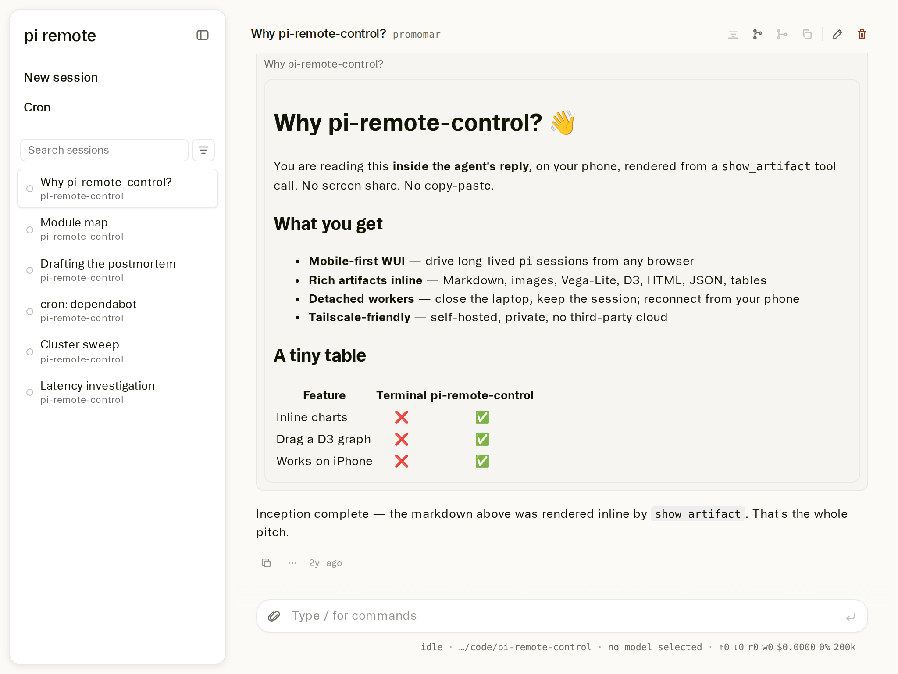
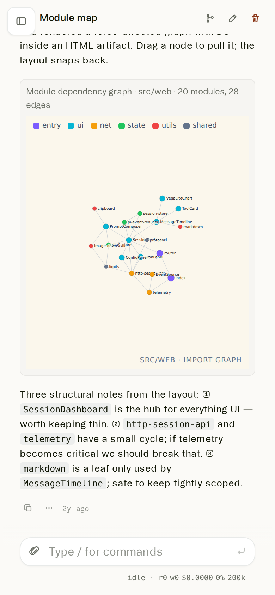
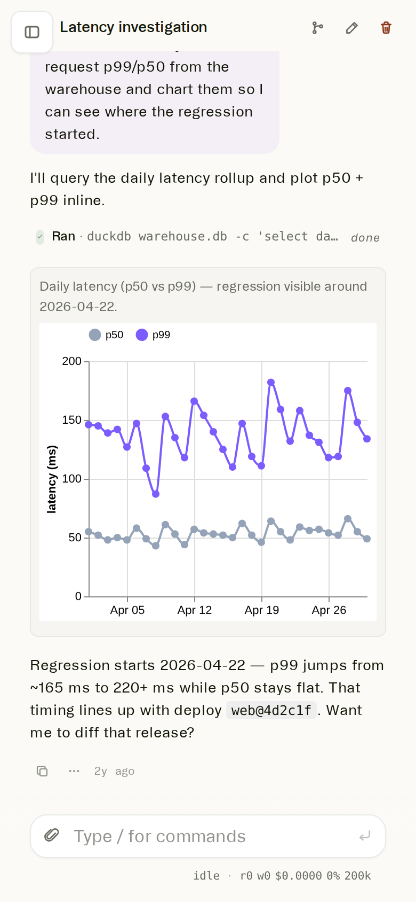
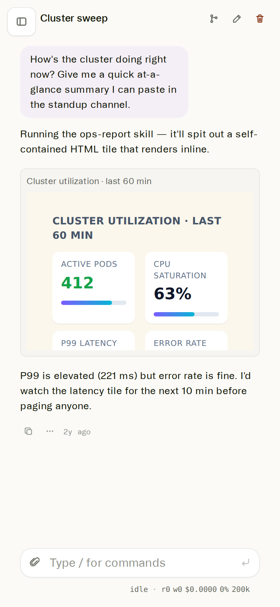

# pi-remote-control

A self-hosted, mobile-first **web remote control for the [pi.dev](https://pi.dev/)
coding agent**. Half-claude code, half-jupyter notebook, half-dashboard.
Run long-lived `pi` sessions on a workstation, then drive them
from your phone, tablet, or any browser — typically over Tailscale on the
private network — without losing context when you close the laptop, hand off
to a phone, or restart the API server.

It comes with first-class support for **rich agent artifacts**: images,
self-contained HTML, Vega-Lite charts, markdown reports, JSON, and tables
that your agent can return from a tool call and have them rendered inline in
the conversation — no copy-paste, no screen-sharing.

<p align="center">
  
</p>

Mobile view — the agent returned an interactive D3 force-directed module-dependency graph via <code>show_artifact</code> and you can drag nodes around right in the conversation. 

<p align="center">
  
</p>

The agent called <code>show_artifact({ kind: "markdown", … })</code> and the Markdown payload — headings, lists, and a comparison table — renders inline, themed to match the WUI. 

<p align="center">
  
</p>

One session, four artifact kinds, no copy-paste. The recording scrolls through (1) a Markdown pitch, (2) a live D3 streaming-sparkline animation, (3) a real seaborn statistical figure (violin + regression + correlation heatmap + KDE), then (4) clicks through the controls of an interactive signal-generator widget — sine, square, saw, noise, pause — all rendered inline by <code>show_artifact</code>. 

<p align="center">
  
  &nbsp;
  
  &nbsp;
  
</p>

More mobile views — the same WUI rendering a D3 force-graph, a Vega-Lite chart, and a self-contained HTML report. All three are <em>artifacts</em> returned from <code>show_artifact</code> tool calls. Captured by <code>npm run promo</code>.

```
                    ┌───────────────────────────────────────┐
   iPhone / iPad ──▶│  /  vite UI  (read & steer)           │
   laptop browser   │  /  EventSource over Tailscale        │
                    │  /                                    │
                    │  HTTP API ◀──▶ session registry       │
                    │      │              │                 │
                    │      │              ▼                 │
                    │      │     pi-rpc supervisor procs    │
                    │      │       │       │       │        │
                    │      ▼       ▼       ▼       ▼        │
                    │   `pi --mode rpc` workers (detached)  │
                    │   one per live session                │
                    │      │                                │
                    │      └─ show_artifact extension ──▶ WUI│
                    └───────────────────────────────────────┘
```

## Why this exists

The pi.dev coding agent is great in a terminal, but the moments you actually
want to look at it are scattered through the day — on the bus, at lunch, in
bed. This project gives `pi` a persistent, multi-session HTTP+SSE front end
so:

- You can kick off a long-running agent run from your laptop, then watch it
  finish from your phone over Tailscale.
- Long tool runs (CI watch, dependabot sweeps, build loops) don't end when
  you close the lid — the agent keeps going inside its `pi --mode rpc`
  worker, and you can reattach whenever.
- When the agent produces a plot, a generated image, an HTML report, or a
  table, it's rendered inline next to the message — not buried in a `cat`
  output.

## Highlights

- **Multi-session WUI.** Sidebar with search / filters / status dots; one
  active session pane on the right.
- **Mobile-first.** Compact mobile status bar, 16-px inputs (no iOS focus
  zoom), overflow-safe code / URL / inline-code rendering, paste-image
  attachment, automatic downscale of oversized images so providers don't
  reject them.
- **Pi RPC adapter with detached workers.** Each live session runs as a
  supervised `pi --mode rpc` subprocess under
  `${XDG_RUNTIME_DIR:-/tmp/pi-remote-control}/sessions/`. The API server
  can be killed and restarted (or upgraded) without losing live sessions —
  the new API process reattaches and replays missed events via SSE
  `Last-Event-ID`.
- **Streaming everything.** Assistant text, thinking, tool calls, tool
  output, message-end and tool-execution-end events all stream over SSE
  while the prompt HTTP request is in flight.
- **Rich artifacts (`show_artifact` extension).** The bundled
  `pi-remote-artifacts` extension registers a `show_artifact` tool the agent
  can call to render in the WUI:
  - `image` — png/jpeg/webp/gif by path
  - `html`  — self-contained HTML in a sandboxed iframe (perfect for
    Plotly, D3, Three.js, custom dashboards)
  - `vega-lite` — Vega-Lite v5 spec object; auto re-themed
  - `markdown` — rendered markdown reports
  - `json` / `table` — structured data with a built-in viewer
- **Session spawning tool (`spawn_prc_session`).** The same bundled extension
  also registers a tool that can create another PRC session with a specific
  cwd/name and kick it off with a prompt. Use it for user-requested parallel
  work; it returns as soon as the child session is visible while prompt
  delivery continues in the background.
- **Extension UI prompts surfaced in the browser.** `confirm`, `select`,
  `input`, `editor`, statuses, notifications, and widget requests from `pi`
  RPC are forwarded to the WUI; the user's response is posted back to
  the worker.
- **Cron-scheduled prompts.** Create named jobs (cron expressions) that
  spawn a fresh `cron: <name>` session at the scheduled time, or fire one
  on demand with **Run now**. "Run now" is fire-and-forget — the HTTP
  request returns as soon as the session is spawned, so the WUI can
  immediately navigate into it and watch the agent work.
- **Browser-driven reload telemetry** (opt-in via `clientEventLogPath`).
  Logs page boots, visibility transitions, EventSource lifecycle, and
  unhandled errors to `logs/client-events.jsonl` so you can diagnose
  spurious refreshes on real devices.
- **HMR off by default** in this deploy. Reading on a phone over Tailscale
  and Vite's HMR client don't get along (iOS suspends background tabs,
  HMR sees stale WS, calls `location.reload()`, you lose your place). Set
  `VITE_PI_REMOTE_HMR=1` to opt back in locally.

## Quick start

One command. Cold machine, no clone, no `npm install` step, no separate
terminals — it installs `pi-remote-control` **and the `pi` coding-agent
itself** as a transitive dependency, builds the WUI, and serves the API +
WUI from the same process:

```bash
npx -y -p github:cemoody/pi-remote-control pi-remote-control
```

Then open the URL it prints (default `http://localhost:8787/`).

Smoke-tested in a fresh `node:22-bookworm` container as the non-root
`node` user (uid 1000), no caches:

- **~30 s** first-ever run — git clone, `npm install`, `vite build`, then boot
- **~15 s** on a warm npm cache (subsequent runs)

> **Note on auth.** While this repo is private, the one-liner needs a
> GitHub token — set one via `gh auth login` or `GH_TOKEN`, plus a git
> `insteadOf` rewrite so npm's hardcoded `ssh://git@github.com/` shortcut
> resolves over HTTPS. Once the repo is public it's literally just the
> one line above.

Knobs that matter most for the one-liner:

```bash
PI_REMOTE_API_PORT=8787   \   # port (also the URL you visit)
PI_REMOTE_API_HOST=0.0.0.0 \  # share on a tailnet / LAN
PI_REMOTE_USE_MOCK=1       \  # offline mock adapter (no `pi` binary needed)
npx -y -p github:cemoody/pi-remote-control pi-remote-control
```

Want PRC to edit itself? There's a second `npx` entrypoint that swaps
the static prod bundle for the full self-edit dev loop — Vite HMR for
the WUI, `tsx`-driven auto-restart for the api (active sessions survive
via detach/reattach), all in a single process:

```bash
npx -y -p github:cemoody/pi-remote-control pi-remote-control-dev
```

Default ports: WUI at `http://localhost:5173/`, api at `:8787`. Both
are logged with colored `[vite]` / `[ api]` prefixes so a single terminal
shows everything. Edit `src/server/**` and the api restarts in <1 s
without losing your chat session; edit `src/web/**` and Vite HMR
patches the running modules in every connected browser.

Auto-pull from `origin/main` is OFF in this mode (the install lives in
`~/.npm/_npx/<hash>/` which won't survive the next `npx` anyway).
Set `PI_REMOTE_DEV_GIT_PULL=1` to opt in.

For a long-term hack-on-PRC setup with persistent edits, see
[Development](#development) for the `git clone` path.

### Self-edit workflow (PRC editing itself)

The default scripts are wired so an agent (or a human) editing PRC's own
source files sees the changes in the running server and browser within
~1 second — no manual restart, no git commit required:

| edit | how it propagates |
|---|---|
| `src/web/**/*.{ts,tsx,css}` | Vite HMR patches the running modules in every connected browser. Scroll, composer drafts, and React state survive. No reload. |
| `src/server/**/*.ts` | `scripts/dev-api.mjs` (driven by `npm run dev:api:loop`) watches the directory with a 500 ms debounce, SIGTERMs the api, which detaches its pirpc supervisors (the actual `pi` processes keep running) and exits. The supervisor respawns it immediately; the new instance `reattachAll()`s to the same supervisors. The user's chat session survives — only the SSE stream blips for ~300 ms and reconnects via `Last-Event-ID`. |
| `vite.config.ts` | A tiny in-config plugin exits the Vite process when the file changes; the outer `dev:web:loop` restart loop brings Vite back with the new config in <1 s. |
| `scripts/pirpc-supervisor.mjs` | Picked up on the *next* worker spawn (each pirpc worker is a fresh `node` fork that re-reads the script from disk). Existing supervisors keep their loaded copy until they exit. |

The same pipeline handles changes that arrived via `git pull` from another
machine — the puller writes to disk, and the file watchers above react
identically. There is no distinction between "agent edited a file" and
"git pulled a new version of that file."

For a long-running dev box that should auto-sync to `origin/main`, run
the in-repo git puller in its own terminal alongside the api / web
supervisors:

```bash
npm run dev:git-puller
```

It's a self-supervising loop — if the inner `git pull` throws, the outer
supervisor catches and resumes after a short delay. The previous setup
(a `&` subshell inside a hand-rolled `prc-loop.sh`) once died silently
and stopped pulling for ~80 minutes before anyone noticed; this script
exists so that can't happen.

**Help-dialog gitSha.** Both rows of the help dialog show the **live**
git HEAD of the checkout. The backend gitSha on `/api/health` is
recomputed on every request (cheap; cached against `.git/HEAD` mtime so
we don't shell out unless a `git pull` actually landed). In dev mode
(`vite serve`), the frontend row falls back to the same backend value
since the dev bundle's modules are HMR-patched from the same checkout.
Production builds (`vite build`) bake the build-time SHA into the
bundle, which can legitimately differ from a remotely-deployed api.

**iOS scroll preservation.** Vite's HMR client historically called
`location.reload()` whenever its WebSocket disconnected, which iOS Safari
triggers on every tab-resume — wrecking scroll position and any draft
composer text. PRC ships a small client-side suppression
(`src/web/utils/hmr-tame.ts`) that cancels the auto-reload when the tab is
hidden or has just resumed. HMR then catches up via its normal reconnect
flow without a page refresh. Set `VITE_PI_REMOTE_HMR=0` to disable HMR
entirely if you ever need the old behavior.

**Active session safety.** The api's SIGTERM handler `detachAll()`s its
sessions before exiting, leaving the pirpc supervisor processes alive
on disk. On the next api boot, `reattachAll()` reconnects to them via
their `/tmp/pi-remote-control/sessions/<sessionId>.sock` files. This
behavior is pinned by `tests/e2e/api-restart-resume.test.ts`, which
restarts the api mid-stream and asserts the final message matches a
no-restart control run.

**Why not `tsx watch`?** The obvious first attempt was `tsx watch`. It
has a fatal hang when its child crashes during *startup* (vs. while
running): tsx watch stays alive waiting for the next file event, and
the outer restart loop never sees an exit signal. This shows up
reliably in the wild any time `prc-loop.sh`'s git puller pulls a PR
that touches multiple files — tsx watch sees an `unlink` mid-pull,
triggers a restart, and the restarted child crashes on a half-written
`package.json`. `scripts/dev-api.mjs` is a small in-house supervisor
that watches with `fs.watch` + a debounce long enough to outlast a
typical pull, and ALWAYS respawns the child on exit. Three invariants
are pinned by `tests/integration/dev-api-supervisor.test.ts`.

### Common env

| variable                          | default                                          | what it does |
|---|---|---|
| `PI_REMOTE_API_PORT`              | `8787`                                           | HTTP+SSE API port |
| `PI_REMOTE_API_HOST`              | `127.0.0.1`                                      | bind address |
| `PI_REMOTE_PROJECT_ROOT`          | `$HOME`                                          | path-policy root for `cwd` of new sessions |
| `PI_REMOTE_SESSION_ROOT`          | `~/.pi/agent/sessions`                           | where session JSONL files live |
| `PI_REMOTE_CRON_FILE`             | `~/.pi/agent/cron-jobs.json`                     | cron job store |
| `PI_REMOTE_CLIENT_EVENT_LOG`      | `<cwd>/logs/client-events.jsonl`                 | client/server telemetry log |
| `PI_REMOTE_ADAPTER`               | `pirpc`                                          | `pirpc` (default) / `pi-sdk` / `mock` (with `PI_REMOTE_USE_MOCK=1`) |
| `PI_REMOTE_DISABLE_CEMOODY_ARTIFACT` | unset                                          | set to `1` to skip auto-loading the bundled `@cemoody/pi-artifact` extension (`display()` tool) |
| `PI_REMOTE_CEMOODY_ARTIFACT_PATH` | unset                                            | override path to a local checkout of `@cemoody/pi-artifact` (entry-point file) |
| `VITE_PI_REMOTE_PROXY_TARGET`     | `http://127.0.0.1:8787`                          | API target the vite dev proxy talks to |
| `VITE_PI_REMOTE_HMR`              | unset                                            | set to `1` to re-enable Vite HMR |

### Adapters

- **`pirpc` (default).** Runs each session in a detached `pi --mode rpc`
  supervisor process so live sessions survive API restarts. Loads the
  bundled `show_artifact` extension **and** auto-registers
  [`@cemoody/pi-artifact`](https://github.com/cemoody/pi-artifact) (the
  `display()` tool for multi-MIME inline artifacts) when it's installed as
  an npm dep. Best for real use.
- **`pi-sdk`.** In-process Pi SDK adapter — no subprocess, no detach. Use
  when you don't need the supervisor.
- **`mock`** (`PI_REMOTE_USE_MOCK=1`). Pure in-memory mock for offline
  development, screenshots, and tests.

## Artifacts: the agent talks to the WUI

The bundled `show_artifact` tool gives the agent a way to render anything it
just produced. From an agent prompt or skill:

```ts
// inside the agent's tool flow
await tools.show_artifact({
  kind: "vega-lite",
  title: "Daily error budget",
  data: {                                  // a Vega-Lite v5 spec
    $schema: "https://vega.github.io/schema/vega-lite/v5.json",
    data: { values: [...] },
    mark: "line",
    encoding: { x: { field: "day", type: "temporal" }, y: { field: "p99", type: "quantitative" } },
  },
});
```

```ts
// or generate a Plotly dashboard offline, return it as HTML
await tools.show_artifact({
  kind: "html",
  title: "Cluster utilization",
  path: "/tmp/util-report.html",            // or pass `html: "<html>..."` inline
  mimeType: "text/html",
});
```

```ts
// or just point at an image you saved
await tools.show_artifact({
  kind: "image",
  title: "tSNE of embeddings",
  path: "out/tsne.png",
  alt: "2-D tSNE projection of 50k embedding vectors",
});
```

The WUI renders the artifact in the timeline as a card with a title, the
content, and a copy / download menu. HTML is rendered in a sandboxed iframe.

## Cron-scheduled prompts

Open the **Cron** tab in the sidebar, create a job (name, cron expression,
prompt, cwd, enabled), and the scheduler spawns a fresh
`cron: <name>` session at each tick. You can also click **Run now**
on any job — the API kicks off the session, returns immediately, and the
WUI navigates straight into the spawned session so you can watch it work.

## Resilience

- Sessions are JSONL files. Killing the API process does **not** kill the
  pi RPC worker; on the next `npm run dev:api` the API reattaches via the
  supervisor's UNIX socket and the WUI's SSE replays missed events from the
  last-seen seq.
- The Vite dev server can be killed and respawned (the included
  `prc-loop.sh` does this in a `while :;` loop along with a 15-s
  `git pull --ff-only origin main` puller, for "always-on-latest" deploys).
- Auto-puller + Vite HMR were a bad combination on mobile; HMR is off by
  default now (`vite.config.ts`).

## Development

### Recommended dev setup (clone path)

For persistent edits and a clean three-terminal layout, after
`git clone`:

```bash
npm install

# Terminal 1 — api supervisor: auto-restarts on src/server/** edits
npm run dev:api:loop

# Terminal 2 — vite: HMR for src/web/**, auto-restarts on vite.config.ts
npm run dev:web:loop

# Terminal 3 (optional) — auto-pull origin/main every 15 s
npm run dev:git-puller
```

Open `http://localhost:5173/`. The same change-propagation contract
from [Self-edit workflow](#self-edit-workflow-prc-editing-itself)
applies: WUI edits HMR in place, api edits trigger a ~300 ms
detach/restart/reattach.

For a one-process equivalent (skip the three terminals, slightly more
limited log multiplexing) see the `pi-remote-control-dev` npx entry in
[Quick start](#quick-start).

### Tasks

```bash
npm install
npm run typecheck           # tsc --noEmit
npm test                    # vitest run (unit + e2e under tests/)
npm run e2e                 # just the e2e tests
npm run e2e:browser         # playwright (mobile layout regression suite)
npm run promo               # playwright (README hero screenshots)
npm run promo:gif           # record the interactive-D3 hero GIF (needs ffmpeg)
npm run check               # typecheck + tests + e2e
npm run build               # vite build of the WUI
```

The screenshots embedded above live under [`promo-screenshots/`](./promo-screenshots/)
(iPhone 14, iPad mini, desktop). Regenerate them after UI changes with
`npm run promo` — it seeds a fresh set of mock sessions (one with a
Vega-Lite chart, one with a self-contained HTML dashboard, one cron-spawned
run, one plain conversation) and writes PNGs into
`promo-screenshots/<viewport>/<state>.png`.

Manual smoke check for the pi RPC + artifacts path (uses the
self-edit loop variants):

```bash
PI_REMOTE_ADAPTER=pirpc npm run dev:api:loop
npm run dev:web:loop
```

Then in the WUI:

1. Create a session.
2. Ask the agent something that streams text and runs a tool — verify the
   stream lands while the prompt request is still in flight.
3. Ask it to produce a `show_artifact` of each kind (image, html,
   vega-lite, markdown, json, table) — verify each renders.
4. Reply to an extension `confirm` / `select` / `input` prompt — verify it
   round-trips.
5. `kill <api-pid>` then `npm run dev:api` again — verify the live session
   reattaches and the SSE catches up to where it left off.

## Telemetry & diagnostics

`logs/client-events.jsonl` receives one JSON line per:

- `boot` — `navigationType`, `bootCount`, `tabSessionId`, `referrer`,
  `activeSessionId`, `userAgent`, `timeOrigin`
- `visibilitychange`, `pagehide` (with `persisted`), `pageshow`,
  `beforeunload`
- `window-error`, `unhandledrejection`
- `sse-open` / `sse-close` (server-side) with `lifetimeMs`
- `sse-client-open` / `sse-client-error` / `sse-client-close`
  (browser-side) with `ageMs`

That was enough to identify a spurious-reload bug as iOS Safari + Vite HMR
in PR #38 (which is also the reason HMR is off by default).

## Status

Production-friendly for "remote control over Tailscale" use. Schema and
protocol are stable enough that detached workers survive API restarts, but
this is still a single-user tool; expect rough edges around multi-user
permissions.

See [`plan.md`](./plan.md) for the implementation roadmap and
[`pirpc-streaming-sse-hardening-plan.md`](./pirpc-streaming-sse-hardening-plan.md)
for SSE replay / hardening notes.
